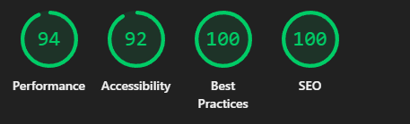
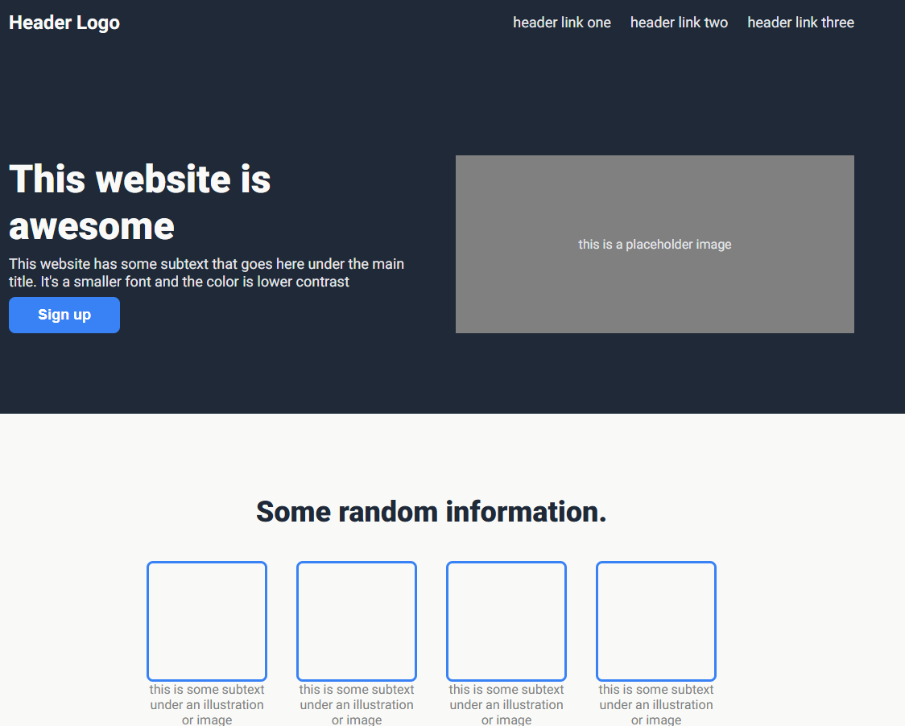

# Project Title

The Odin project landing page.

---

## Overview

This project is The Odin Project's html and css practice project.

- The main idea of the project is to learn html and css
- What problem it solves (or what you are practicing)
- L

---

## Learning Goals

- Learn html and css
- Learn flexbox
- Learn layout

---

## Tech Stack

- Language: HTML5
- Framework / Library: None
- Styling: CSS3
- Tools: None
- Other dependencies: None

---

## Features

- Mobile responsive []

---

## What I Learned

- What I learned about the main concept
- What was difficult
- How I solved problems
- What I would improve next time
